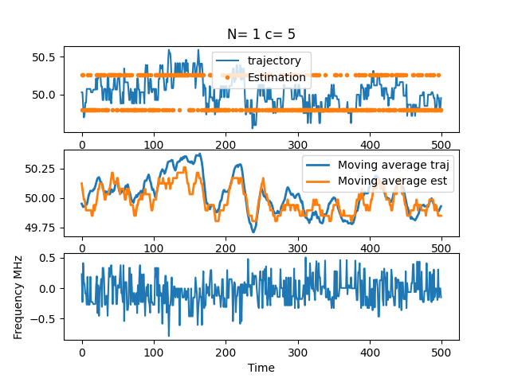
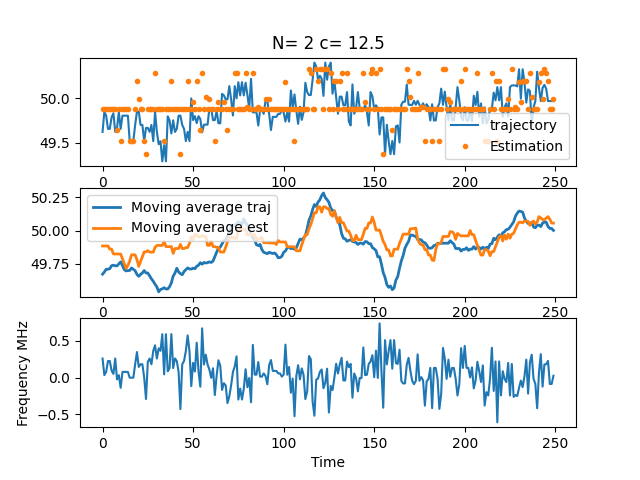
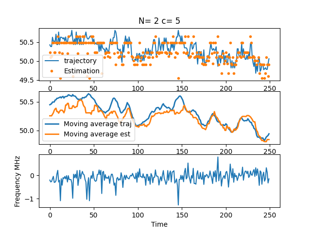
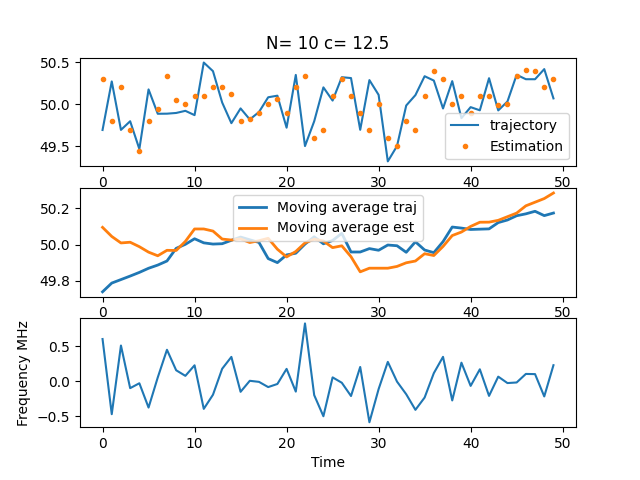
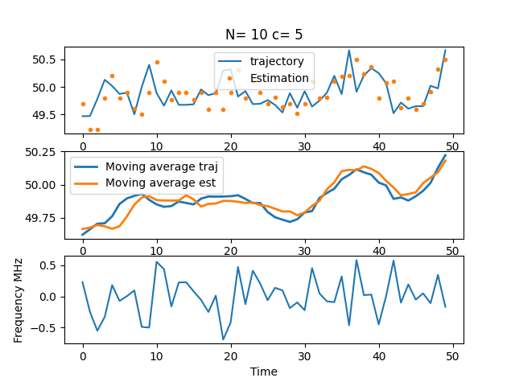
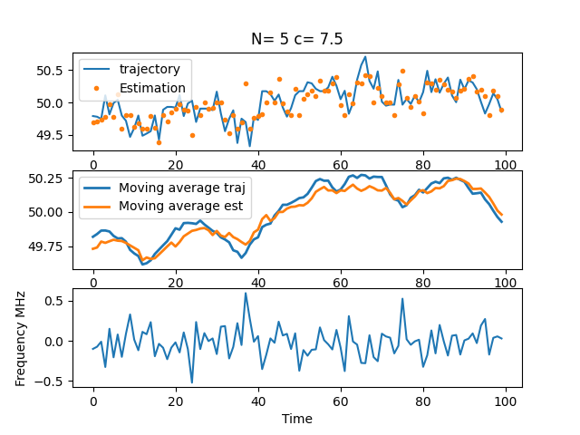
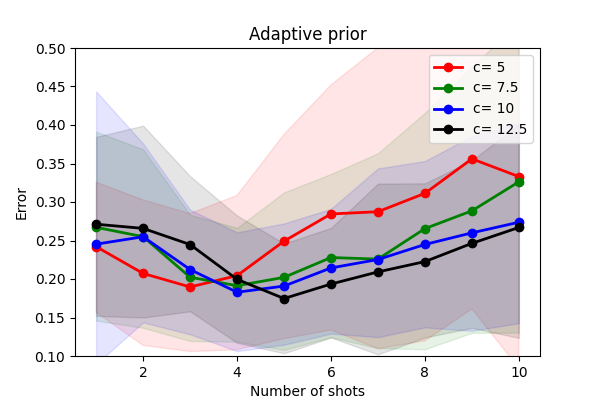
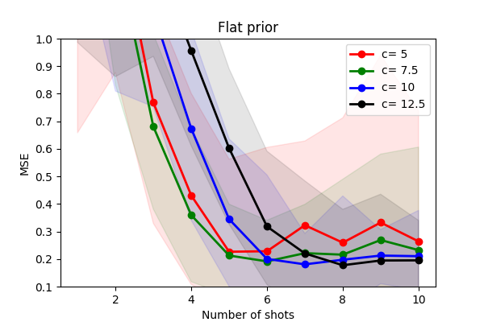
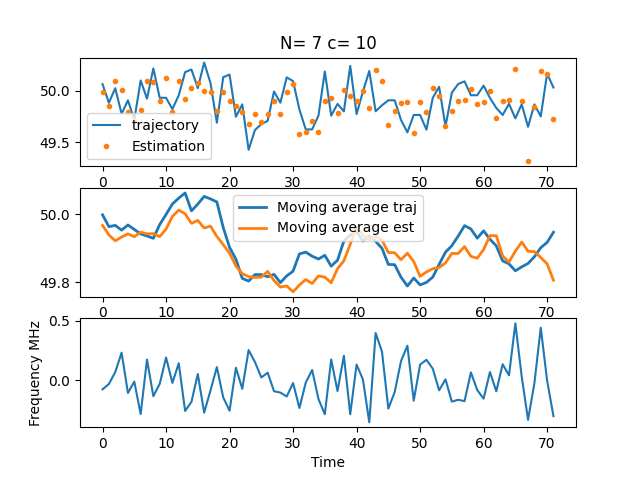

# TL:DR
Here we characterize the performance of the adaptive estimation scheme for the frequency estimation of low-frequency components of 1/f noise. To gauge the error in estimating the low-frequency component, we use the MSE between the estimated frequency and the  true frequency after estimation procedure.

## Parameters

### Fixed   
- Amplitude of charge fluctuations $S_1 
\sim  1\mu $eV$^2$ /Hz 
 Average frequency $\omega_0 = 50$ MHz
- Charge to spin conversion factor $2 \times 10^{-4}$ , that maps to $\sigma_\omega = 0.2$ MHz 
- Tracking time $T = 5$ms - how long we track the frequency
- Number of telegraphs $N = 20$

### Variable:
- Number of shots $N_{\text{shots}} = 1-10$ - number of shots to average over
- Coefficient $c = \tau_{n+1}/\sigma_n =  8$

#### Trajectories:

For $N=1$ we can estimate moving average, but we need small c

For $N=2$ too large c gives too soft adaptive scheme

For large number of shots $N=10$ the estimation takes longer so we have huge jumps in trajectories. Also if adaptive scheme is agressive (low $c$) is large probability of outliers:

Finally the best set of parameters is $N_{\text{shots}} = 5$ and $c = 7.5$:

### Plot of $c$ and $N_{\text{shots}}$ dependence

#### Comparision to flat prior

For flat prior the trade-off is not visible. This is because for small $N$ we just draw a random frequency from flat prior

Also arguably the best set is not as best as the adaptive-prior one

